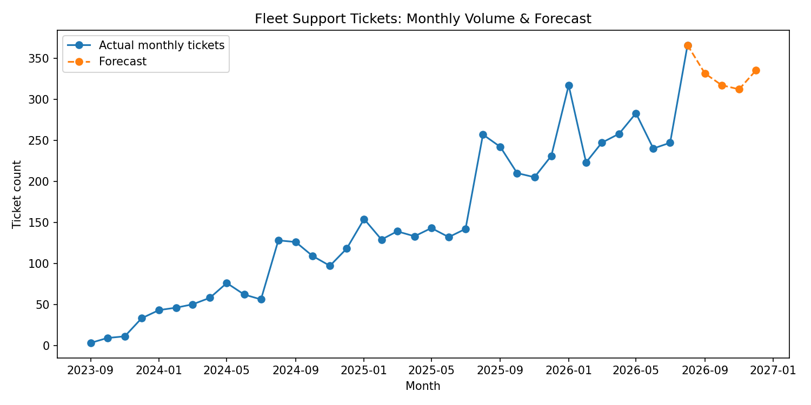
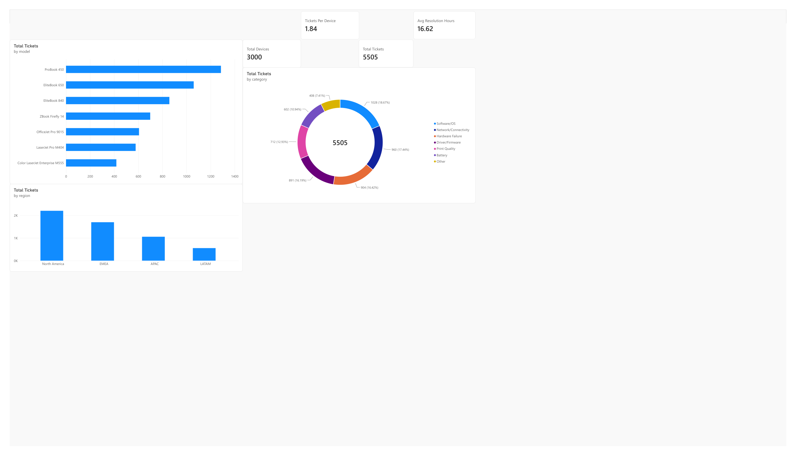
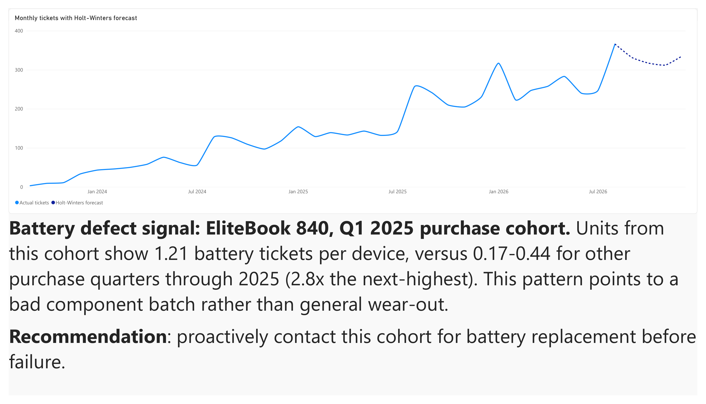
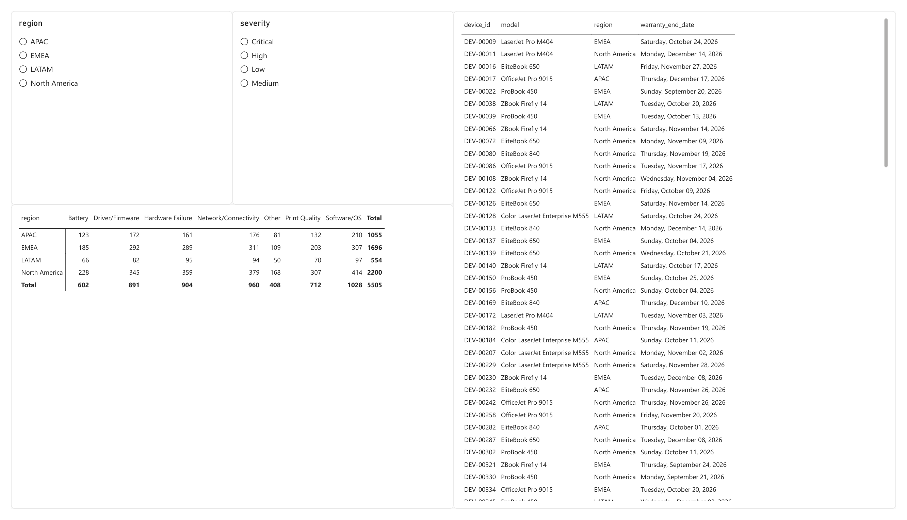

# Fleet Health & Support Forecasting

An analytics project on a problem enterprise IT support teams face: given a fleet of deployed devices and
their support ticket history, what is driving support load, and what is coming next?

The data is synthetic: 3,000 laptops and printers across 4 regions and 5,505 tickets over about 3 years.
A battery defect is deliberately hidden in one laptop model's purchase cohort, and the analysis has to find
it the way a real support team would spot a bad batch in ticket data before any recall.

The findings are in [`summary/executive_summary.md`](summary/executive_summary.md), and the full walkthrough
with charts is in [`notebooks/fleet_health_analysis.ipynb`](notebooks/fleet_health_analysis.ipynb), which
renders directly on GitHub.

## Results



- **Defect cohort:** EliteBook 840 units bought in Q1 2025 show 1.21 battery tickets per device, versus
  0.17-0.44 for the other purchase quarters through 2025.
- **Forecast:** a Holt-Winters model predicts 317 tickets in October 2026 and misses by 3.9% on average on a
  6-month holdout (a last-value baseline misses by 16.7%).
- **Severity drives resolution time:** Critical tickets take about 15x longer to resolve than Low (69 vs.
  4.6 hours), and category differences disappear within a severity level.
- **Ticket auto-tagging:** a TF-IDF and logistic regression classifier reaches 88% held-out accuracy
  ([report](outputs/classifier_report.txt)). The text is templated synthetic data, so this shows the method,
  not real-world accuracy.

## Dashboard
A Power BI report built on the same data (the `.pbix` is not committed; these are exports).





## Project structure
```
src/
  generate_data.py   # synthetic devices + tickets, seeded so every run is identical
  build_db.py        # loads the CSVs into PostgreSQL
  queries.sql        # cohort, trend, severity and warranty-expiry SQL
  forecast.py        # Holt-Winters forecast of monthly ticket volume, overall and by region
  categorize.py      # TF-IDF + logistic regression ticket classifier
  pipeline.py        # runs all of the above in order
notebooks/           # narrated analysis with charts (executed, renders on GitHub)
outputs/             # committed results: forecast CSVs, chart, classifier report
data/                # generated CSVs and trained model (gitignored, regenerate anytime)
powerbi/             # dashboard exports (PDF and PNG)
summary/             # executive summary
docker-compose.yml   # local PostgreSQL
```

## Setup
Requires Python 3.10+ and Docker.
```powershell
docker compose up -d       # PostgreSQL on localhost:5432 (database, user and password: fleet)
pip install -r requirements.txt
python src/pipeline.py     # generate data, load PostgreSQL, forecast, train the classifier
```
Run the SQL with `psql -h localhost -U fleet -d fleet -f src/queries.sql` (password `fleet`) or any Postgres
client. Set `PGHOST`, `PGPORT`, `PGDATABASE`, `PGUSER` and `PGPASSWORD` to point at a different instance.
The forecast and classifier read the CSVs directly, so only the SQL analysis needs the database.

## Limitations
- The data is synthetic. The seasonality, defect and severity patterns were built in, so the analysis shows
  the method works, not that these effects exist in any real fleet.
- The data ends on Sep 14, 2026. The partial September is excluded from the forecast fit.
